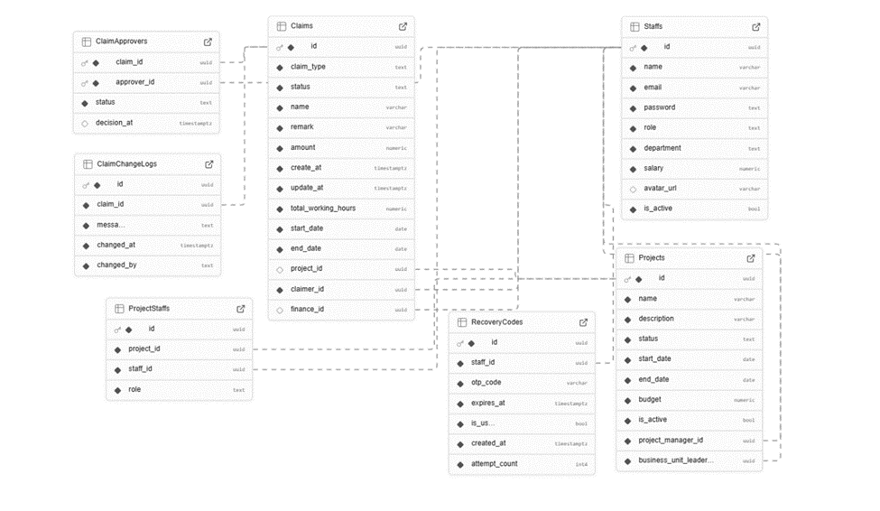

# net04-2025-claimrequest-team1

## Project Overview

A modern claim request management system built with .NET 8.0, featuring multi-layer architecture and containerization support. The SRS is included in the project source code for reference

### Architecture Layers

- **API Layer**: REST API endpoints and request handling
- **Business Layer**: Core business logic and service implementations
- **Data Layer**: Database operations and entity models
- **AI Layer**: Integration with AI services
- **Unit Tests**: Comprehensive test coverage

## Technology Stack

### Backend Framework

- ASP.NET Core 8.0
- Entity Framework Core 8.0
- AutoMapper for object mapping
- Hangfire for background jobs
- JWT Bearer authentication
- Swagger/OpenAPI documentation

### Database & Storage

- PostgreSQL (Supabase)
- Cloudinary (File storage)
- PgAdmin 4 (Database management)

### Development Tools

- Docker & Docker Compose
- Visual Studio 2022/VS Code
- Git for version control

## Database Schema



## Prerequisites

- [Docker](https://www.docker.com/get-started) installed on your machine.
- [Docker Compose](https://docs.docker.com/compose/install/) installed.

## Getting Started

Follow these steps to run the application:

1. **Clone the Repository**

   Clone this repository to your local machine using:

   ```bash
   git clone <repository-url>
   cd <repository-directory>
   ```

2. Access to the ClaimRequest.API/appsetting.json
   - first time build the Application:
     - set ApplyMigration: false to true (Enable auto EF Core Migration)
   - next time build the Apllication:
     - set ApplyMigration: true to false (Using existing DB)

## Development Setup

### Prerequisites

- Docker Desktop
- .NET 8.0 SDK
- Git
- Visual Studio 2022 or VS Code

### Local Development Steps

#### We will persit the database by using Docker and Running by the HTTP Option in Visual Studio / Rider

1. **Clone Repository**

```bash
git clone <repository-url>
cd ClaimRequest
```

2. **Configure Database Connection**

```json
{
  "ConnectionStrings": {
    "PostgresConnection": "Host=localhost;Database=ClaimRequestDB;Username=db_user;Password=Iloveyou3000!;Port=5432"
  }
}
```

3. **Run Database Container**

```bash
docker-compose up -d claimrequest.db
```

4. **Start API (VS Code)**

- Press `F5` with the `http` launch profile
- API will be available at `http://localhost:5000`

## Deployment Guide

### Supabase Database Setup

1. **Create Supabase Project**

- Go to [Supabase Dashboard](https://app.supabase.io)
- Create new project
- Get connection string from Database Settings

2. **Configure Production Connection String**

- The connection string we get is look like this also make sure to use the pooled section connection string

```json
{
  "ConnectionStrings": {
    "SupabaseConnection": "User Id=postgres.ceazsqmwbxytiiqnidgq;Password=Iloveyou3000!;Server=aws-0-ap-southeast-1.pooler.supabase.com;Port=5432;Database=postgres"
  }
}
```

### Azure Web Service Deployment (Manual Deployment)

1. **Create Azure Web App**

   - Go to [Azure Portal](https://portal.azure.com).
   - Navigate to "App Services" and click "Create".
   - Select your subscription and resource group.
   - Choose a unique name for your Web App.
   - Select the runtime stack as `.NET 8.0`.
   - Configure other settings as needed and click "Review + Create".

2. **Publish API to Azure**

   - Open the project in Visual Studio.
   - Right-click on the API project and select "Publish".
   - Choose "Azure" as the target.
   - Select the Web App you created in the Azure portal.
   - Click "Publish" to deploy the API.

3. **Configure Database Connection**

   - Go to the Azure Portal and navigate to your Web App.
   - Under "Settings", select "Configuration".
   - Add the connection string for your Supabase database under "Connection Strings".
   - Use the name `SupabaseConnection` and paste the connection string.

4. **Verify Deployment**

   - Access your Web App URL (e.g., `https://<your-web-app-name>.azurewebsites.net/swagger/index.html`).
   - Test the API endpoints to ensure they are working correctly.

5. **Monitor and Scale**

   - Use the "Monitoring" section in the Azure Portal to track performance.
   - Scale up or out as needed using the "Scale Up" or "Scale Out" options.

### Health Monitoring

- Database connection health check: `http://localhost:5000/health/db`
- API status: `http://localhost:5000/health`
- Container status: `docker-compose ps`

## Troubleshooting

### Common Issues

1. **Database Connection**

- Verify connection string
- Check Supabase dashboard for connection limits
- Ensure proper pooling configuration

2. **Performance**

- Monitor connection pool usage
- Check Supabase quotas
- Review query execution plans

### Logging

```bash
# View API logs
docker-compose logs api

# View database logs
docker-compose logs claimrequest.db
```

From HCM25_CPL_NET04 Team 1 with LUV
